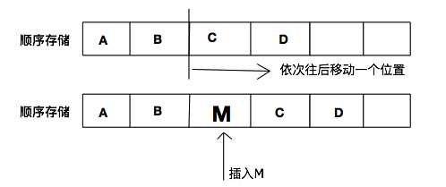
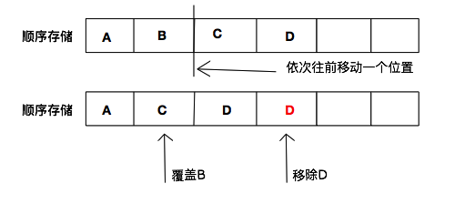
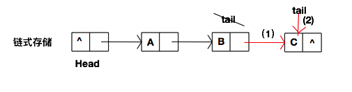
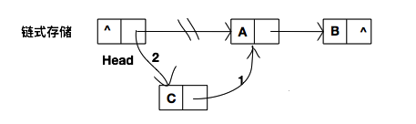
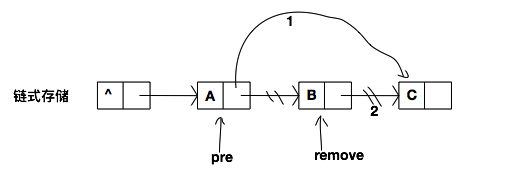
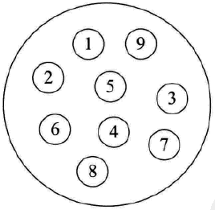
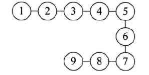
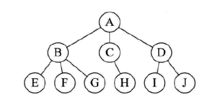
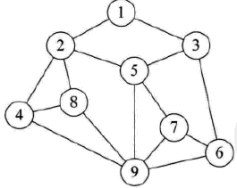
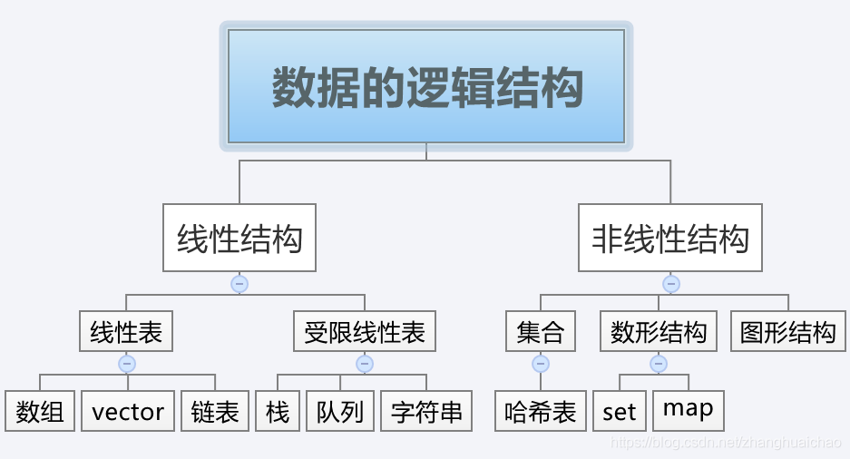

# 数据结构基础

### 1. 什么是数据结构
    
    
### 2. 数据的存储结构

##### 2.1 顺序存储结构

概念：顺序存储结构是存储结构类型中的一种，该结构是把逻辑上相邻的结点存储在物理位置上相邻的存储单元中，结点之间的逻辑关系由存储单元的邻接关系来体现。
当然不得不说一般这种官方的解释都是不太适合我的，所以用小甲鱼的方式来说这个概念的话，简单来说就是，用一段连续的地址存放数据元素，数据间的逻辑关系和物理关系相同。

 优点1：存储密度大，空间利用度高，比链式存储节约空间

 优点2：存储操作上方便操作，顺序支持随机存取，查找会比较容易

 缺点1：插入或者删除元素时不方便，花费的时间更多

##### 2.1.1 往顺序线性表中插入数据

见下图往B与C之间插入一个M，在插入之前我们需要将CD整体往后移一个位置，为M空出一个位置，再见M放入。

##### 2.1.2 从顺序线性表中删除数据

与上面所说的插入其实挺像的，前者在插入位置后的元素都往后移，二一处则是向左移覆盖掉要删除的元素，需要注意的是，要将最后一个元素进行移除，可以参考下图

##### 2.2 链式存储结构

概念：链式存储结构，又叫链接存储结构。在计算机中用一组任意的存储单元存储线性表的数据元素(这组存储单元可以是连续的,也可以是不连续的).它不要求逻辑上相邻的元素在物理位置上也相邻.因此它没有顺序存储结构所具有的弱点,但也同时失去了顺序表可随机存取的优点

优点1：插入或删除时方便些，空间使用灵活

缺点1：存储密度小，空间利用度低

缺点2：查找会相较顺序存储方式复杂一些，花费的时间会更多

##### 2.2.1 往链式线性表中插入数据

往链表的后方添加元素

往链表的头部插入元素

##### 2.2.2 从链式线性表中删除数据

### 3. 数据的逻辑结构

##### 3.1 集合结构

集合结构中的数据元素处理同属于一个集合里，它们之间没有其他关系。各个数据元素是`平等`的，它们的共同属性是“同属于一个集合”。数据结构中的集合关系就类似于数学中的集合，满足集合的三个基本性质，确定性，互异性，无序性，而满足这个性质的应该只有C语言里的结构体满足这个条件，因为结构体里的数据无序，互异，确定。

##### 3.2 线性结构

线性结构中的数据元素之间存在`一对一`的关系，满足这个关系的有  线性表（数组，链表），队列，栈，串

线性表：零个或者是多个数据元素的有限序列。

下面对其定义进行下充分的解读，首先它是一个序列，也就是说元素之间是有顺序的，若元素存在多个，则第一个元素无前驱，最后一个元素无后继，其他每个元素都有且之后一个前驱和后继。然后线性表强调是有限的，当元素个数为零个时称为空表。

所以线性表的元素之间是满足一对一的关系的

栈：栈(stack)是限定仅在表尾进行插入和删除操作的线性表，是一种特殊的线性表，所以属于线性结构

队列：队列(queue)是只允许在一端进行插入操作，而在另外一端进行删除操作的线性表，是一种特殊的线性表，所以属于线性结构

串：串(string)是由零个或者多个字符组成的有限序列。

看定义我们就能清楚的看到，串是特殊的线性表，只是把定义中的数据元素换成了特定的字符元素，所以串也是属于线性结构

一般情况下，把栈，队列，串，分为一组叫受限线性表。 

##### 3.3 树形结构

树形结构中的数据元素之间存在一种`一对多`的层次关系，一般分为一般树和二叉树，满足这个关系的有 set,map

##### 3.4 图形结构

图形结构的数据元素是`多对多`的关系，一般分为有向图和无向图

###### 3.5 汇总

