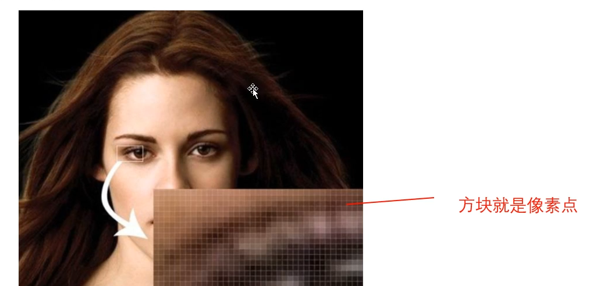
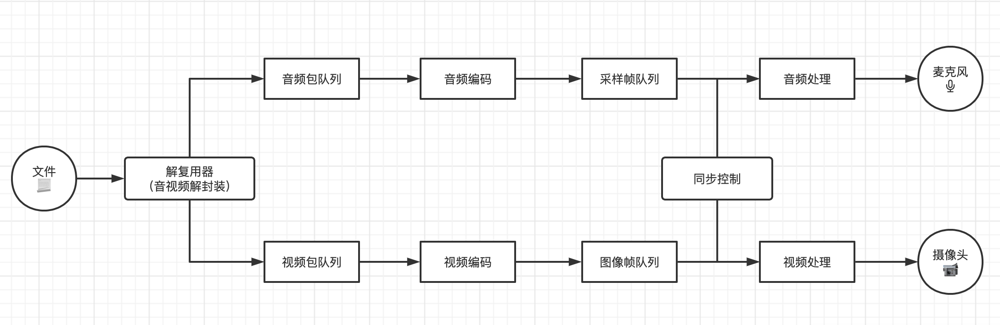

# 图像基础

### 1. 图像基础概念

##### 1.1 像素
像素是一个图片的基本单位，`pix`是英文单词`picture`的简写，
加上英文单词元素 `element`，就得到了 `pixel`，简写`px`，
所以`像素`有`图像元素`的意思。

##### 1.2 分辨率
分辨率值图像的大小或者尺寸。比如：1080*1080.

##### 1.3 位深
位深值在记录单个像素表示的颜色时的大小范围。比如红绿蓝分别8bit,加上8bit的透明通道。
就是32位深，也是真彩色；

`RGBA`：颜色编码方式
`YUV`：是将亮度参量和色度参量分开进行表示的像素编码格式（Y:Luminance或者Luma；UV：Chrominance或者Chroma）

##### 1.4 帧率
指的是图像，在1秒钟时间里，传输的图片的帧数，也可以理解为图像处理器每秒钟能够刷新几次。
比如60fps就表示每一秒有60张图片。

##### 1.5 码率
指的是视频文件在单位时间内使用的数据流量，比如1Mbps。

##### 1.6 Stride
指的是在内存中每行像素所占用的空间。为了实现内存对齐每行像素在内存中所占用的空间并不一定是图像的宽度。

### 2. 音视频播放原理

